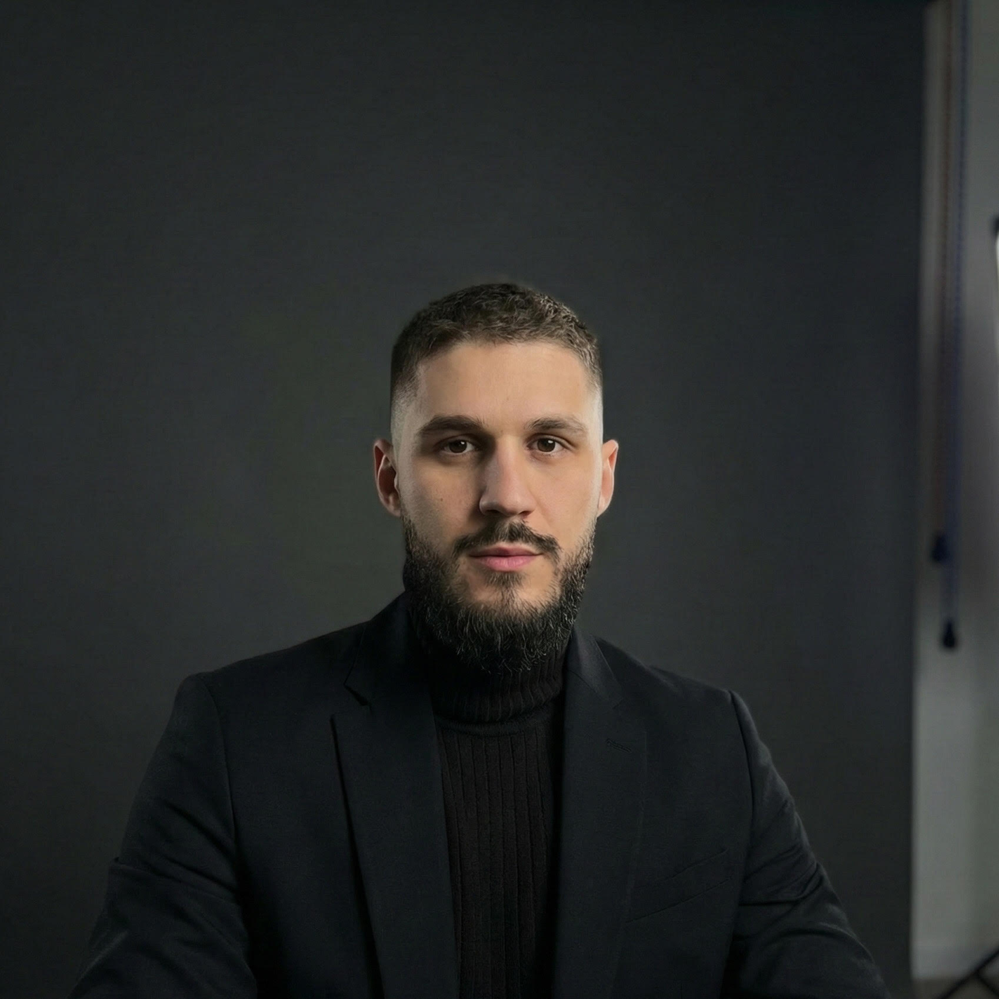

# Foto Đumišić - Client Website Project 📸

Hello! 👋 I'm a student developer, and this is my first official web development project for a real-world client: **Foto Đumišić**, a photography business. 

This project was built to practice my frontend skills, structure a complete real-world application, and learn how to manage client requirements. It serves as a digital portfolio and business card for the photography studio.

## 🚀 Tech Stack Highlights
Through this project, I learned to integrate several modern web technologies:
*   **React 19 & TypeScript**: Building a robust, type-safe frontend UI.
*   **Vite**: For incredibly fast builds and local development server.
*   **Tailwind CSS 4**: Used for rapid, responsive, and modern styling.
*   **React Router v7**: For seamless Multi-Page Application routing (`Home`, `About`, `Portfolio`, `Contact`).
*   **Motion**: Implementing smooth animations like the `Preloader` and `AnimatedTestimonials` for a premium feel.
*   **Lucide React**: Beautiful vector icons.

## 📂 Project Structure & Features
*   **Pages:**
    *   `HomePage.tsx` - A welcoming landing page highlighting the photography services.
    *   `PortfolioPage.tsx` - A gallery showcasing the client's best work.
    *   `AboutPage.tsx` - Information about the studio and the photographer.
    *   `ContactPage.tsx` - A contact form and location details for prospective clients.
*   **Components:** Built custom reusable pieces like a responsive `Layout` wrapper, a cool `Preloader` for polished initial loading, and an `AnimatedTestimonials` section for social proof.

## 💡 What I Learned
1.  **Component Architecture:** Breaking down the UI into logical, reusable components (`Layout`, `Preloader`).
2.  **State & Animations:** Using external libraries to add complex animations without degrading performance.
3.  **Client-Focused Design:** Designiing a UI/UX that emphaszes large, high-quality images, giving priority to visual content over text, exactly what a photographer needs!
4.  **Deployment Prep (Netlify):** I also configured `netlify.toml` and `_redirects` to ensure the React Router works perfectly on Netlify when the site is deployed.

This has been an amazing learning journey! Thanks for checking out my work. 🎓✨
